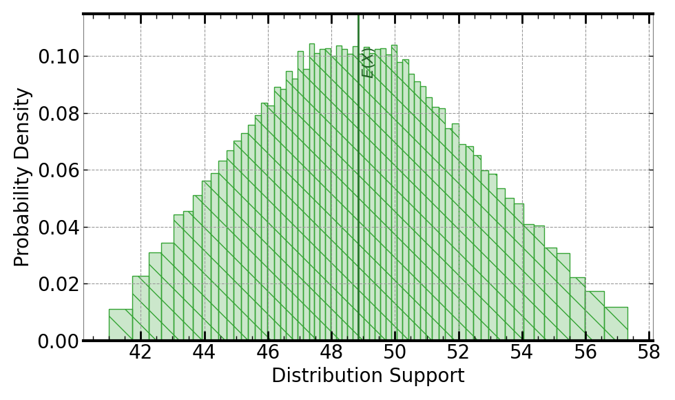
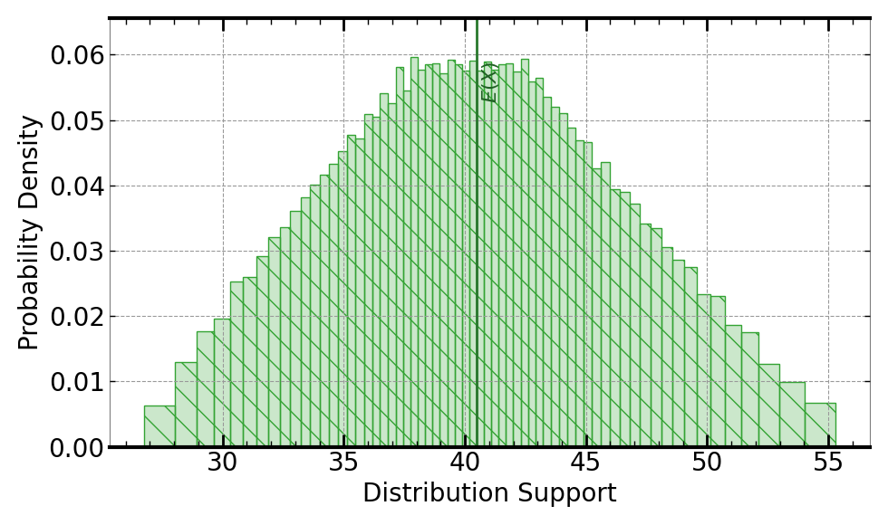
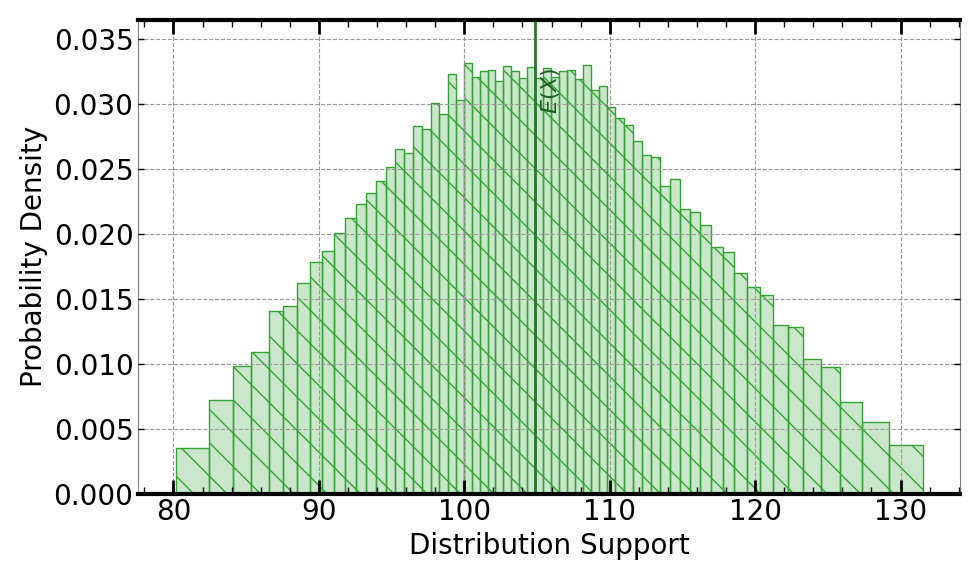

[](https://signaloid.io/repositories?connect=https://github.com/signaloid/Signaloid-Demo-Sensors-SensirionSHT4xIAnalogConversionRoutines#gh-dark-mode-only)
[](https://signaloid.io/repositories?connect=https://github.com/signaloid/Signaloid-Demo-Sensors-SensirionSHT4xIAnalogConversionRoutines#gh-light-mode-only)

# Sensirion SHT4xI Sensor Calibration Use Case
Example demonstrating real-time output uncertainty estimation for calibrated ADC values from the SHT4xI sensor[^1].

## Introduction
The SHT4xI is a humidity and temperature sensor IC[^1].

## Getting started

The correct way to clone this repository to get the submodules is:
```sh
	git clone --recursive git@github.com:signaloid/Signaloid-Demo-Sensors-SensirionSHT4xIConversionRoutines.git
```

If you forgot to clone with `--recursive` and end up with empty submodule directories, you can remedy this with:
```sh
	git submodule update --init
```

## Running the application locally
Apart from using Signaloid's Cloud Compute Platform, you can compile and run this application
locally. Local execution is essentially a native Monte Carlo implementation,
that uses GNU Scientific Library (GSL)[^2] to generate samples for the different input distributions.
In this mode the application stores the generated output samples, in a file called `data.out`.
The first line of `data.out` contains the execution time of the Monte Carlo implementation
in microseconds (μs), and each
next line contains a floating-point value corresponding to an output sample value.
Please note, that for the Monte Carlo output mode, you need to select a single output
to calculate, using (`-S`) command-line option.

In order to compile and run this application in the native Monte Carlo mode:

0. Install dependencies (e.g., on Linux):
```
sudo apt-get install libgsl-dev libgslcblas0
```
1. Compile natively (e.g., on Linux):
```
cd src/
gcc -I. -I/opt/local/include main.c utilities.c common.c uxhw.c -L/opt/local/lib -o native-exe -lgsl -lgslcblas -lm
```
2. Run the application in the MonteCarlo mode, using (`-M`) command-line option:
```
./native-exe -M 10000 -S 0
```
The above program runs 10000 Monte Carlo iterations, calculating the output chosen by (`-S 0`) command-line option.
3. See the output samples generated by the local Monte Carlo execution:
```
cat data.out
```

## Inputs
The inputs to the SHT4xI sensor conversion algorithms are the ratiometric analog voltage output of the sensor
for the relative humidity measurement in Volts($V_{RH}$),
the ratiometric analog voltage output of the sensor for the temperature measurement in Volts ($V_{T}$),
as well as the Supply voltage of the sensor ($V_{dd}$). The algorithm models the uncertainty in the analog output as
well as in the supply voltage using uniform distributions.

The uncertainty in $V_{RH}$ is modeled as a (`UniformDist(2.3, 2.7)`) Volts.

The uncertainty in $V_{T}$ is modeled as a (`UniformDist(2.3, 2.7)`) Volts.

The uncertainty in $V_{dd}$ is modeled as a (`UniformDist(4.8, 5.4)`) Volts.


## Outputs
The output can be the calibrated relative humidity in percentage, the calibrated temperatrue in Celsius or
in Farenheit. Select between the different outputs using the `-S` command-line parameter:
- `-S 0`: Calculates the Relative Humidity, given by
```math
\mathrm{RH} = -12.5 + 125 * \frac{V_{RH}}{V_{dd}}
```

Following is an example output, using Signaloid's C0Pro-S core:




- `-S 1`: Calculates the Temperature in Celcius, given by
```math
\mathrm{Temperature_Celsius} = -66.875 + 218.75 * \frac{V_{T}}{V_{dd}}
```

Following is an example output, using Signaloid's C0Pro-S core:




- `-S 2`: Calculates Temperature in Fahrenheit, given by
```math
\mathrm{Temperature_Farenheit} = -88.375 + 393.75 * \frac{V_{T}}{V_{dd}}
```

Following is an example output, using Signaloid's C0Pro-S core:



- `-S 3`: Calculates all previous calibrated outputs. Selected by default.


## Usage
```
Example: SHT4xI sensor conversion routines - Signaloid version

Usage: Valid command-line arguments are:
	[-o, --output <Path to output CSV file : str>] (Specify the output file.)
	[-S, --select-output <output : int>] (Compute 0-indexed output. Calculate all possible outputs if equal to 3. Default value: 3.)
	[-M, --multiple-executions <Number of executions : int (Default: 1)>] (Repeated execute kernel for benchmarking.)
	[-T, --time] (Timing mode: Times and prints the timing of the kernel execution.)
	[-b, --benchmarking] (Benchmarking mode: Generate outputs in format for benchmarking.)
	[-j, --json] (Print output in JSON format.)
	[-h, --help] (Display this help message.)
```


---

[^1]: [SHT4xI Humidity and Temperature Sensor IC](https://www.mouser.com/datasheet/2/682/Sensirion_Datasheet_SHT4xI_analog-3045759.pdf).

[^2]: [GNU Scientific Library](https://www.gnu.org/software/gsl/).

